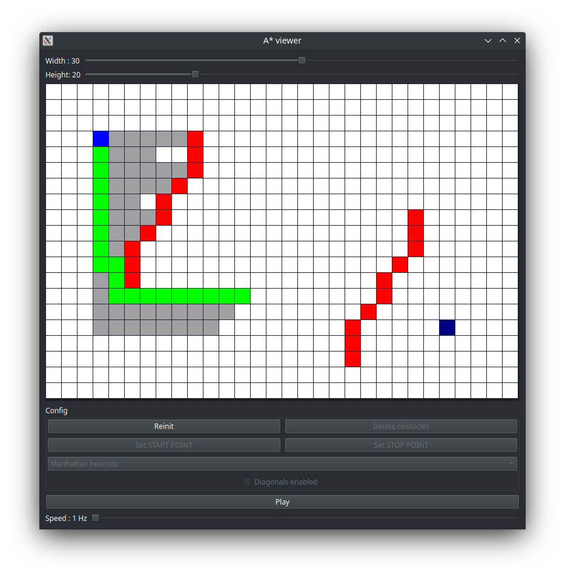
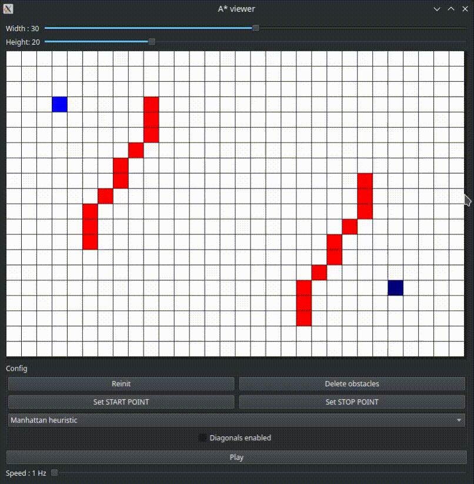

# a_star_viewer_qt

A simple "A* viewer/player" implementation in C++ Qt (widget) for visualizing the A* algorithm.
You can configure the algorithm with the following :
- Starting point
- End / target point
- Obstacles
- Diagonal movements
- Size of the map
- Heuristic

Then you can choose the execution speed (from 1 to 25 Hz/fps) and launch the computations.

## Demo

**Screenshot** 

**GIF demo**

## Dependencies
- Qt 5.15 (widget) 
- [My A* C++ implementation](https://github.com/benjamin-carpene/a_star)
 (see my repos)
